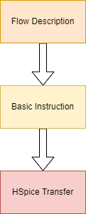
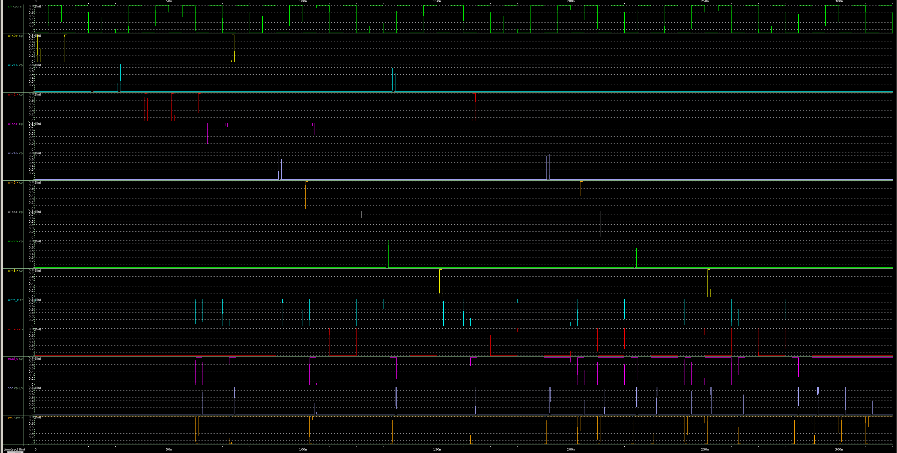

# Hspice-Wave-Generator

## Introduction

**Hspice-Wave-Generator** is a tool used to quickly generate stimuli souces of hspice format. 

The tools are consisted of 3 parts and they are implemented using Python.

1. The flow description contains the description about the total computation flow using the instruction function.

2. The basic instruction is the function of the instruction.

3. And the process of HSpice transfer is a format converter which can convert the bitstream into the description with HSpice format.

All the stimuli sources are based on `pwl` function of HSPICE and the specific complex operations of writing hspice description are encapsulated and the user only needs to provide the array input.

## Content

> ├───doc
> ├───example
> │   ├───cpu_sim
> │   │   ├───case1
> │   │   ├───netlist
> │   │   └───source
> │   └───models
> │       ├───45nm
> │       └───7nm
> ├───version1
> ├───version2
> └───version

The doc folder contains the images of the README.

The example folder contains a hspice example using the generated source by version2 or version3.

The version1, version2 and version3 contain differrent description of the stimuli sources.

## Usage

To generate your stilimu source, you add the operation of your instruction in the signal.py. Then you can modify the process of the operation in the main.py. Finally, you can use `python main.py` to get the stimuli sources.

## Example

The example is a simple cpu, which only supports multiplication and addition operation. In the cpu, there are SRAM, ALU and 3 registers. The version2 and version3 can generate the stimuli source to drive the hspice simulaiton of the cpu.

In version3, the `main.py` gives the test cases, which using the cpu to do the 2x2 marix multiplicaiton. After defining the instruction's detailed operation, it's easy to describe the overall process. 

The next image shows the stimuli sources generated by this tool. The sources conclude WL<15:0>, Din<3:0>, Pre-Charge, SA_EN, etc.

